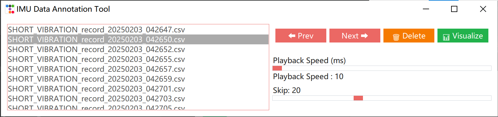
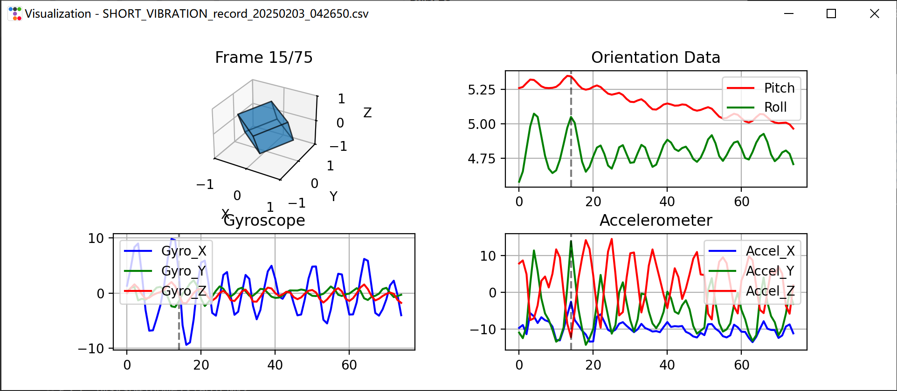

# IMU Motion Analysis Toolkit

Tools for IMU sensor data processing and visualization

## Usage

```bash
git clone --depth=1 https://github.com/FluxSand/Dataset.git Dataset
python train.py
# cp model.onnx XXX
```

## 📦 Files

### 1. CNN Motion Classifier (`train.py`)

**Features**:

- Advanced data preprocessing pipeline
  - Sequence padding & normalization
  - Stratified dataset splitting
- ONNX model export capability
- Embedded early stopping & learning rate scheduling

### 2. IMU Data Visualizer (`imu_visualizer.py`)

**Features**:

- Interactive CSV file management
  - File browsing & deletion
  - Auto-refresh directory
- Multi-view sensor visualization
  - 3D pose animation with adjustable parameters
  - Synchronized 2D plots (Pitch/Roll/Gyro/Accel)
  - Enhanced real-time data updates
- Customizable playback controls
  - Frame skip ratio (1-50)
  - Speed adjustment (10-200ms)
  - Interactive zoom and rotation

**Requirements**:

```text
numpy~=2.0.2
pandas~=2.2.3
tensorflow~=2.18.0
tf2onnx~=1.16.1
onnx~=1.17.0
scipy~=1.15.1
imblearn~=0.0
scikit-learn~=1.6.1
matplotlib~=3.10.0
ttkbootstrap~=1.10.1
```

## 📂 Dataset Structure

Each CSV should contain:

```csv
Pitch,Roll,Gyro_X,Gyro_Y,Gyro_Z,Accel_X,Accel_Y,Accel_Z
```

## 📸 Sample Output

**Classifier Training**:

```text
Epoch 150/2000
187/187 [==============================] - 15s 78ms/step - loss: 0.0327 - accuracy: 0.7215
Val accuracy: 0.6982 → Best model saved
```

**Visualizer Interface**:


